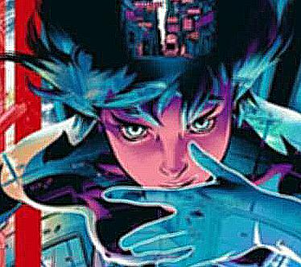
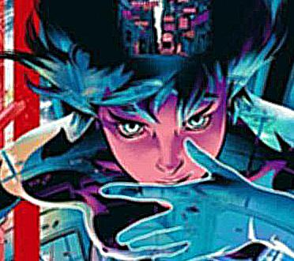
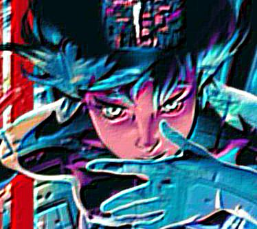

# Лабораторная работа 3. Повышение резкости изображений.

# 1 Исходное изображение


# 2 Гауссово размытие

Функция для получения свертки гауссового размытия:
```
def get_gauss_kernel(size = 3, sigma = 1):
    center = (int)(size / 2)
    kernel = np.zeros((size, size))
    
    for i in range(size):
       for j in range(size):
          diff = np.sqrt((i-center)**2+(j-center)**2)
          kernel[i,j] = np.exp(-(diff**2)/(2*sigma**2))
    return kernel / np.sum(kernel)
```

Функции обработки массива цветовых данных путем применения матрицы свертки, 
получения массива цветовых данных из изображения и преобразования результата в результирующие изображения:
```
def conv(img, krn):
    
    is0, is1, ks0, ks1 = *img.shape, *krn.shape
    rs0, rs1 = is0 - ks0 + 1, is1 - ks1 + 1
    res = np.zeros((rs0, rs1), dtype = krn.dtype)
    
    for i in range(rs0):
        for j in range(rs1):
            res[i, j] = (krn * img[i : i + ks0, j : j + ks1]).sum()
            
    return res

def get_array(image):
    output_image = image.convert("RGB")
    width = image.width
    height = image.height
    r_arr = np.zeros((width, height))
    g_arr = np.zeros((width, height))
    b_arr = np.zeros((width, height))
    
    for x in range(width):
        for y in range(height):
            r, g, b = output_image.getpixel( (x, y) )
            r_arr[x][y] = r
            g_arr[x][y] = g
            b_arr[x][y] = b
            
    return r_arr, g_arr, b_arr

def create_img(r_arr, g_arr, b_arr):
    sizeX = len(r_arr)
    sizeY = len(r_arr[0])
    
    new_img = Image.new('RGB', (sizeX, sizeY))
    for x in range(sizeX):
        for y in range(sizeY):
            r = int(r_arr[x][y])
            g = int(g_arr[x][y])
            b = int(b_arr[x][y])
            new_img.putpixel( (x, y), (r, g, b) )
            
    return new_img     
```

Исходное изображение и после гауссового размытия:

 

# 3 Применение к изображению матрицу свертки усиления границ:

```
print('processing...')

img_gaus = Image.open(r"gaus.jpg")
sharpness = get_sharpness_kernel()

r_arr, g_arr, b_arr = get_array(img_gaus)
r_c = conv(r_arr, sharpness)
g_c = conv(g_arr, sharpness)
b_c = conv(b_arr, sharpness)


img_sharpness = create_img(r_c, g_c, b_c)
img_sharpness.save('sharpness.jpg')
img_sharpness
```
Результат усиления границ (до и после):

 

# 4 Две любые функции повышающие резкость изображения

Используем формулу $e+a*(e-H) $, где e-единичный импульс, a-усиление, H-гауссова свертка для получения матрицы свертки усиления границ:
```
print('processing...')
#e+α(e−H)
gaus = get_gauss_kernel(5, 3)
unit = get_unit_kernel(5)
kernel = unit+5*(unit - gaus)


img_gaus = Image.open(r"gaus.jpg")

r_arr, g_arr, b_arr = get_array(img_gaus)
r_c = conv2d(r_arr, kernel)
g_c = conv2d(g_arr, kernel)
b_c = conv2d(b_arr, kernel)


img_sharpness = create_img(r_c, g_c, b_c)
img_sharpness.save('matrix.jpg')
img_sharpness
```
 

Используем другую матрицу свертки для получения изображения с усиленными границами
```
print('processing...')

img_gaus = Image.open(r"gaus.jpg")
sharpness = get_emboss_kernel()

r_arr, g_arr, b_arr = get_array(img_gaus)
r_c = conv2d(r_arr, sharpness)
g_c = conv2d(g_arr, sharpness)
b_c = conv2d(b_arr, sharpness)


img_sharpness = create_img(r_c, g_c, b_c)
img_sharpness.save('emboss.jpg')
img_sharpness
```

 

